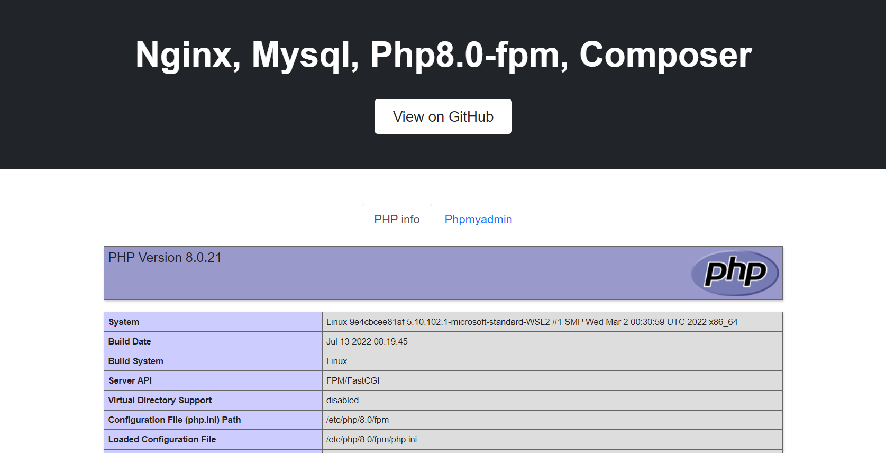

### Features
- Simple and clear project structure;
- Php the latest version 8.0 (can be changed if you need);
- All necessary php extensions including composer and xDebug3;
- Output all necessary logs (nginx, mysql, php-fpm, composer), including slow mysql queries;
- Quick, easy setup for everything you need

### What's inside

* [Nginx](http://nginx.org/)
* [MySQL](http://www.mysql.com/)
* [PHP-FPM](http://php-fpm.org/)


### Requirements

* [Docker Engine](https://docs.docker.com/installation/)
* [Docker Compose](https://docs.docker.com/compose/)
* [Docker Machine](https://docs.docker.com/machine/) (Mac and Windows only)

### Before start work

To run the docker commands without using **sudo** you must add the **docker** group to **your-user**:

```bash
sudo usermod -aG docker your-user
```

For now, this project has been mainly created for Unix `(Linux/MacOS)`. Perhaps it could work on Windows.

### How to start

Clone current project:
```bash
git clone https://github.com/Leslie-Wong/docker-lesliew-lemp.git && cd docker-lesliew-lemp && docker-compose up
````

If you want to change PHP version. 

Edit File:
```bash
/docker/nginx/Dockerfile
````

```bash
ARG PHP_VERSION=8.0
````
To
```bash
ARG PHP_VERSION=your_version
````

And you should see something like:


### Makefile
This file helps to quickly interact with the work of docker and additional features.
Read about available commands `make help`

```
Commands:
  init                                     Init skeleton settings
  help                                     List of all commands in make file
  install                                  Install application
  add-host                                 Add nginx host to /etc/hosts file
  bash                                     Exec backend container
  build                                    Build docker-compose
  build-no-cache                           Build docker-compose without cache
  up                                       Up with demon docker containers
  down                                     Down docker containers
  stop                                     Stop docker containers
  clear-all-logs                           Clear all logs in folder /logs
  clear-logs-in folder=[FOLDER]            Clear logs in folder
  watch-log logFilePath=[PATH TO LOG FILE] Watch log file
```

### Project tree

```
📦docker
 ┣ 📂mysql
 ┃ ┣ 📂conf.d
 ┃ ┃ ┗ 📜my.cnf
 ┃ ┗ 📜Dockerfile
 ┣ 📂nginx
 ┃ ┣ 📂conf.d
 ┃ ┃ ┗ 📜default.conf
 ┃ ┣ 📂logs
 ┃ ┃ ┣ 📜access.log
 ┃ ┃ ┣ 📜error.log
 ┃ ┃ ┣ 📜www-access.log
 ┃ ┃ ┗ 📜www-error.log
 ┃ ┣ 📂php
 ┃ ┃ ┗ 📂pool.d
 ┃ ┃ ┃ ┗ 📜www.conf
 ┃ ┣ 📂phpmyadmin
 ┃ ┣ 📂src
 ┃ ┃ ┣ 📂public
 ┃ ┃ ┃ ┣ 📜index.php
 ┃ ┃ ┃ ┗ 📜phpinfo.php
 ┃ ┃ ┣ 📂src
 ┃ ┃ ┃ ┣ 📂bin
 ┃ ┃ ┃ ┃ ┗ 📜supervisord.php
 ┃ ┃ ┃ ┣ 📂views
 ┃ ┃ ┃ ┃ ┗ 📜index.php
 ┃ ┃ ┃ ┗ 📜Application.php
 ┃ ┃ ┣ 📜.gitignore
 ┃ ┃ ┣ 📜composer.json
 ┃ ┃ ┗ 📜composer.lock
 ┃ ┣ 📜default.template.conf
 ┃ ┣ 📜Dockerfile
 ┃ ┗ 📜nginx.conf
 ┣ 📂php
 ┃ ┣ 📂conf.d
 ┃ ┃ ┣ 📜php.ini
 ┃ ┃ ┗ 📜xdebug.ini
 ┃ ┗ 📜Dockerfile
```

### Project links
- [Homepage](http://127.0.0.1/)
- [PhpMyAdmin](http://127.0.0.1/phpmyadmin)

### More documentation
You can also read more information about the project

| Doc                        | README                                     |
|----------------------------|--------------------------------------------|
| xDebug configuration       | [docs/xdebug.md](docs/xdebug.md)           |
| Code sniffer configuration | [docs/codesniffer.md](docs/codesniffer.md) |

### License

MIT
